# 소비(SOBI) 시연 시나리오

> SSAFY 15기 특화 프로젝트 · J15D101 · 소상공인 정책자금 플랫폼
> 서비스 주소 https://j15d101.p.ssafy.io
> 이미지 속 **빨간 원과 번호**가 클릭(또는 주목)할 위치입니다. 번호 순서대로 진행하면 됩니다.

---

## 0. 시연 전 준비

| 준비물 | 내용 |
|---|---|
| 브라우저 탭 2개 | **탭 1** — 로그아웃 상태(랜딩 화면) · **탭 2** — 사업자 계정으로 이미 로그인된 대시보드 |
| 시연 계정 | 화면 예시는 `박성현 / 한상차림(경북 고령군·한식음식점)` 기준입니다. 페르소나 계정 6개가 준비돼 있고 비밀번호는 모두 `sobi1234` |
| 업로드용 서류 | 바탕화면에 `사업자등록증.png`, `소상공인확인서.jpg`, `국세 납세증명서.jpg`, `지방세 납세증명서.pdf` 를 미리 꺼내 두기 |
| 일부러 틀릴 서류 | **다른 사람 명의 서류 1장**을 같은 폴더에 두기 (검증 실패를 보여줄 용도) |
| 서버 | 시연 당일 **배포 금지(master 머지 동결)**. 시작 전에 컨테이너 상태와 사이트 접속을 한 번 확인 |
| 주의 | 마이데이터 연동은 **24시간 쿨다운**이 걸려 있습니다. 리허설과 본 시연에서 같은 계정을 두 번 연동할 수 없으니 계정을 나눠 쓰세요 |

### 전체 흐름

| 순서 | 화면 | 보여줄 것 | 예상 시간 |
|---|---|---|---|
| 1 | 랜딩 → 로그인 → 사업자 인증 | 가입과 인증이 한 번에 끝난다 | 1분 |
| 2 | 마이데이터 연동 · 자격 판정 | 연동 한 번으로 전체 상품이 판정된다 | 1분 |
| 3 | 대시보드 | 내 사업장 현황이 한 화면에 | 1분 |
| 4 | 상권 분석 | 데이터로 보는 동네 | 1분 30초 |
| 5 | 자금 조합 | 가장 적게 갚는 조합 추천 | 1분 |
| 6 | 지원사업 · 자연어 검색 | 말로 찾는 공고 | 1분 |
| 7 | 서류 업로드 · AI 검증 · 초안 작성 | **핵심 기능** | 2분 30초 |
| 8 | 대출 신청 → 상환 관리 | 실행부터 완납까지 | 1분 30초 |

---

# PART 1. 처음 들어온 사장님 (탭 1)

## 1-1. 랜딩 화면

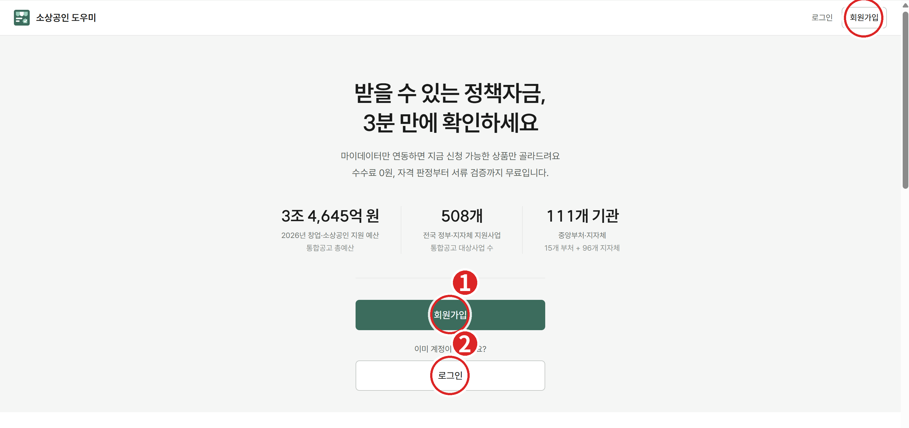

| 번호 | 위치 | 동작 |
|---|---|---|
| ① | 가운데 **회원가입** 버튼 | 신규 가입을 시작할 때 클릭 |
| ② | 아래 **로그인** 버튼 | 기존 계정으로 들어갈 때 클릭 (시연에서는 이쪽 사용) |
| ③ | 우측 상단 로그인 / 회원가입 | 어느 화면에서든 같은 동작 |

**말할 것**
> "2026년 기준으로 111개 기관이 508개 사업에 3조 4,645억 원을 씁니다. 그런데 사장님들은 자기가 받을 수 있는 게 뭔지 모릅니다. 소비는 그걸 3분 만에 알려 드립니다. 수수료는 0원입니다."

**확인 포인트** — 상단 숫자 3개(예산·사업 수·기관 수)는 화면 장식이 아니라 **문제의 크기**를 보여주는 근거입니다. 여기서 한 번 짚고 넘어가면 뒤의 기능 설명이 훨씬 잘 붙습니다.

---

## 1-2. 로그인

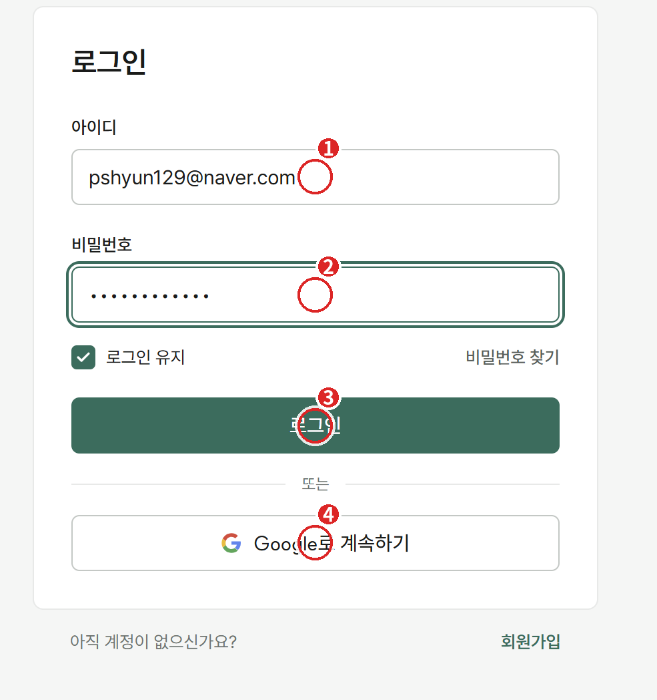

| 번호 | 위치 | 동작 |
|---|---|---|
| ① | 아이디 | `pshyun129@naver.com` 입력 (또는 `p1@sobi.test`) |
| ② | 비밀번호 | `sobi1234` 입력 |
| ③ | **로그인** | 클릭 |
| ④ | **Google로 계속하기** | 소셜 로그인을 보여줄 때만 사용 |

**말할 것**
> "이메일 가입과 구글 로그인을 모두 지원합니다. 구글로 들어온 계정도 사업자 인증만 하면 동일하게 쓸 수 있습니다."

**주의** — 구글 로그인은 **실제 구글 계정 선택 창**이 뜹니다. 시연 시간이 촉박하면 ③ 이메일 로그인으로 진행하고, 소셜 로그인은 "이렇게도 됩니다" 정도로 언급만 하세요.

---

## 1-3. 사업자 인증

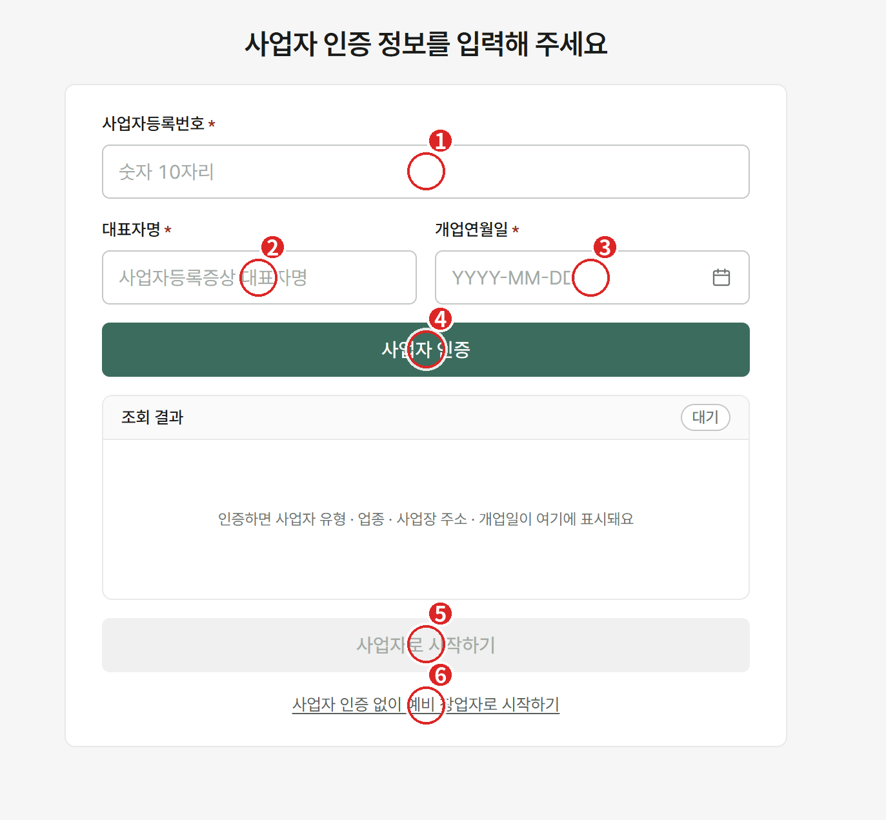

| 번호 | 위치 | 동작 |
|---|---|---|
| ① | 사업자등록번호 | 숫자 10자리 입력 |
| ② | 대표자명 | 사업자등록증상 이름 |
| ③ | 개업연월일 | `YYYY-MM-DD` |
| ④ | **사업자 인증** | 클릭 → 아래 **조회 결과**가 `대기` 에서 실제 값으로 바뀜 |
| ⑤ | **사업자로 시작하기** | 인증이 끝나야 활성화됨 |
| ⑥ | 사업자 인증 없이 예비 창업자로 시작하기 | 예비창업자 경로 |

**말할 것**
> "국세청 진위확인으로 실제 존재하는 사업자인지 확인합니다. 인증이 끝나면 업종·사업장 주소·개업일이 자동으로 채워져서, 사장님이 직접 입력할 게 없습니다."
> "아직 사업자등록 전이라면 아래 ⑥으로 들어갑니다. 예비창업자는 상권 분석과 예비창업자 대상 공고를 먼저 볼 수 있습니다."

**확인 포인트** — ④를 누른 뒤 **조회 결과 박스가 채워지는 것**을 꼭 보여주세요. 이 화면의 핵심은 "입력이 아니라 조회"라는 점입니다.

---

## 1-4. 마이데이터 연동과 자격 판정

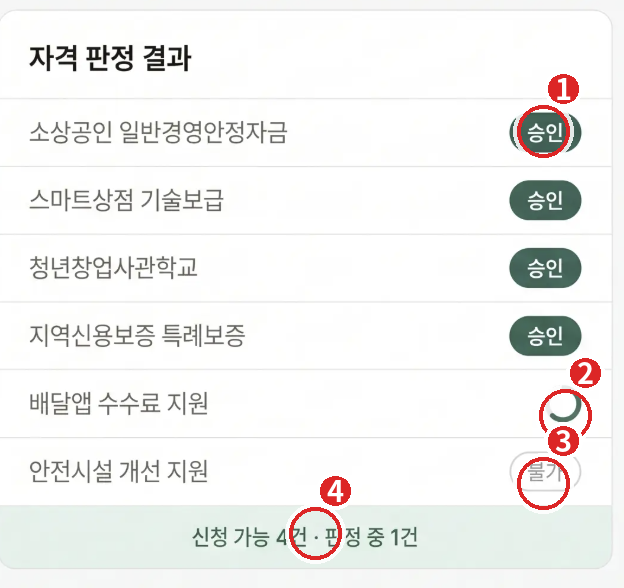

| 번호 | 위치 | 의미 |
|---|---|---|
| ① | `승인` 배지 | 조건을 **숫자로 대조해 통과**한 상품 |
| ② | 로딩 표시 | 지금 LLM이 공고문을 읽고 **판정 중**인 항목 |
| ③ | `불가` 배지 | 요건에 명확히 걸려 신청할 수 없는 상품 |
| ④ | 하단 요약 | `신청 가능 4건 · 판정 중 1건` — 진행 상황이 실시간으로 갱신됨 |

**말할 것**
> "마이데이터를 연동하면 계좌·대출·신용등급·매출·4대보험이 한 번에 들어옵니다. 그리고 대출 20개, 지원사업 211개를 **전부** 판정합니다."
> "지역·업종·매출처럼 숫자로 떨어지는 조건은 필터로, '시군구 제한'이나 '1인 사업장'처럼 문장을 읽어야 하는 조건은 AI가 공고문을 직접 읽고 판단합니다."
> "판정은 가능·확인 필요·불가 세 가지입니다. **모르면 '불가'로 단정하지 않고 '확인 필요'로 남깁니다.** 사장님이 놓치는 걸 막기 위해서입니다."

**주의** — 연동과 전체 판정은 수십 초가 걸립니다. 진행되는 동안 위의 판정 로직을 설명하면 대기 시간이 자연스럽게 채워집니다. **연동 버튼을 여러 번 누르지 마세요.**

---

# PART 2. 사업자 대시보드 (탭 2)

여기부터는 **이미 로그인·연동이 끝난 탭 2**로 전환합니다.

## 2-1. 대시보드

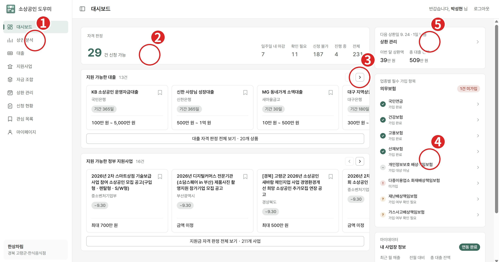

| 번호 | 위치 | 설명 |
|---|---|---|
| ① | 좌측 메뉴 **상권 분석** | 다음 단계로 이동할 버튼 |
| ② | 자격 판정 요약 `29건 신청 가능` | 전체 231건 중 가능/확인 필요/불가 분포 |
| ③ | 지원 가능한 대출 캐러셀 `>` | 상품 카드를 넘겨 보여주기 |
| ④ | 업종별 의무보험 체크리스트 | 마이데이터와 대조해 `가입 완료 / 미가입 / 확인 필요`로 표시 |
| ⑤ | 상환 관리 요약 | 다음 상환일 · 이번 달 상환액 · 총 잔액 |

**말할 것**
> "로그인하면 처음 보이는 화면입니다. 신청 가능한 대출 13건, 지원사업 16건이 바로 뜹니다."
> "오른쪽 의무보험은 업종별로 **가입해야 하는 보험**을 마이데이터와 대조한 결과입니다. 한식음식점은 8개가 대상이고, 이 사장님은 화재배상책임보험 1건이 미가입입니다. 과태료가 나오는 항목이라 실제로 도움이 되는 정보입니다."

---

## 2-2. 상권 분석

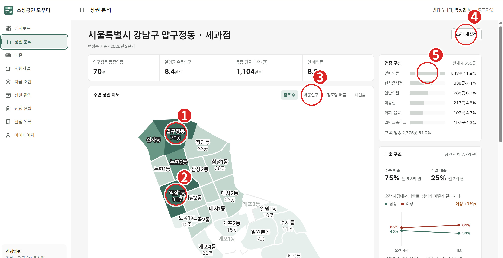

| 번호 | 위치 | 동작 |
|---|---|---|
| ① | 지도에서 **선택된 동**(압구정동) | 진한 색이 현재 선택. 마우스 휠로 확대·축소 |
| ② | **다른 동 클릭**(역삼1동 등) | 클릭하는 즉시 상단 지표와 우측 패널이 그 동 기준으로 바뀜 |
| ③ | 지표 전환 탭 | `점포 수 / 유동인구 / 점포당 매출 / 폐업률` — 같은 지도를 네 가지 색으로 다시 그림 |
| ④ | **조건 재설정** | 업종·지역을 바꿔서 다시 조회 |
| ⑤ | 우측 **업종 구성 · 매출 구조** | 상권 전체 업종 비중, 주중/주말 비중, 성별 매출 전환 |

**말할 것**
> "서울시 상권 데이터 3만 5천여 건을 기반으로, 창업하려는 동네를 숫자로 봅니다."
> "압구정동은 동종업종 70곳, 일평균 유동인구 8.4만 명, 점포당 월매출 1,104만 원, 연 폐업률 8.6%입니다. **옆 동을 클릭하면** 바로 비교가 됩니다." (②를 눌러 다른 동으로 전환)
> "여기 오른쪽이 재미있는데요, **오간 사람의 성비와 실제 매출의 성비가 다릅니다.** 여성이 9%p 더 많이 씁니다. 타깃을 정할 때 쓰는 정보입니다."

**확인 포인트** — 시연에서는 ② → ③ 순서로 **두 번만** 클릭하세요. 지도를 오래 만지면 시간이 훅 갑니다.

---

## 2-3. 자금 조합 — 입력

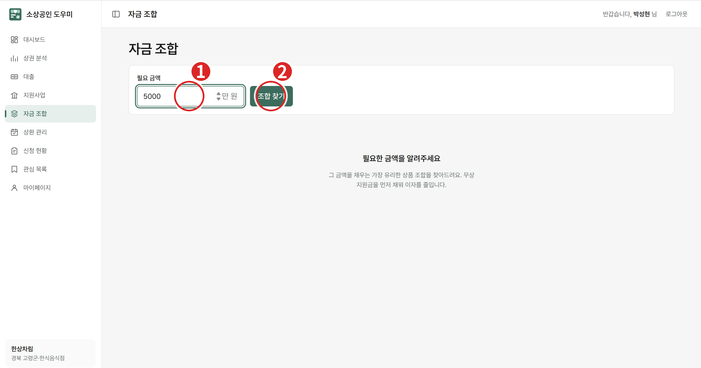

| 번호 | 위치 | 동작 |
|---|---|---|
| ① | 필요 금액 | `5000` 입력 (단위: 만 원) |
| ② | **조합 찾기** | 클릭 |

**말할 것**
> "사장님이 필요한 건 '대출 상품'이 아니라 '5천만 원'입니다. 금액만 넣으면 그 금액을 채우는 방법을 찾아 드립니다."

---

## 2-4. 자금 조합 — 결과

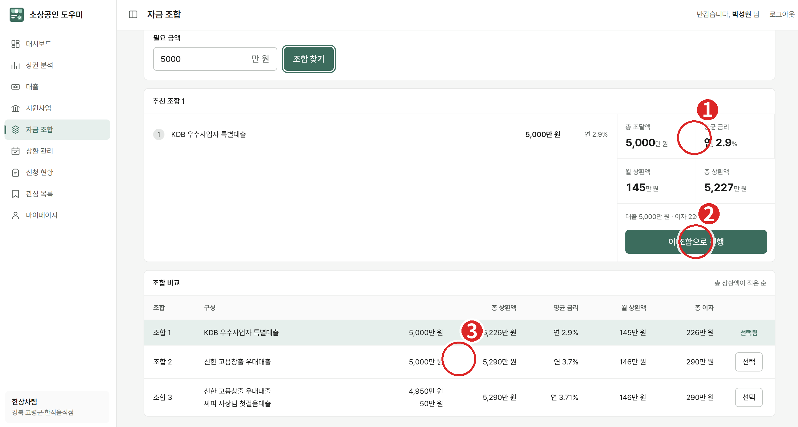

| 번호 | 위치 | 설명 |
|---|---|---|
| ① | 추천 조합 요약 | 총 조달액 · 평균 금리 · **월 상환액** · 총 상환액 |
| ② | **이 조합으로 진행** | 포함된 상품 전부를 한 번에 신청 시작 |
| ③ | 조합 비교 표 | 총 상환액이 적은 순으로 3개 조합 비교 |

**말할 것**
> "정렬 기준은 금리가 아니라 **총 상환액**입니다. 실제로 사장님 통장에서 나가는 돈이 기준입니다."
> "무상 지원금이 있으면 지원금으로 먼저 채우고, 부족한 금액만 대출로 구성합니다. 이 사장님은 조합 1이 총 5,226만 원으로 가장 적게 갚습니다. 조합 2보다 이자가 64만 원 적습니다."
> "조합을 고르면 포함된 상품을 한 번에 신청하러 갑니다."

---

## 2-5. 지원사업 목록

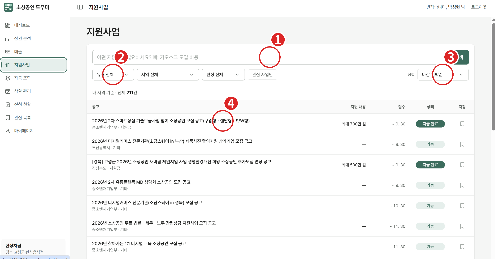

| 번호 | 위치 | 동작 |
|---|---|---|
| ① | 검색창 | 다음 장면에서 자연어로 검색 |
| ② | 필터 `유형 / 지역 / 판정` | 조건으로 좁히기 |
| ③ | 정렬 `마감 임박순` | 기본값 |
| ④ | 공고 행 | 클릭하면 상세 모달 |

**말할 것**
> "제 자격 기준으로 판정된 211건입니다. 오른쪽 상태 배지가 아까 본 가능 / 확인 필요 / 불가입니다. 마감 임박순이 기본이라 **지금 신청할 수 있는 것부터** 보입니다."

---

## 2-6. 자연어 검색

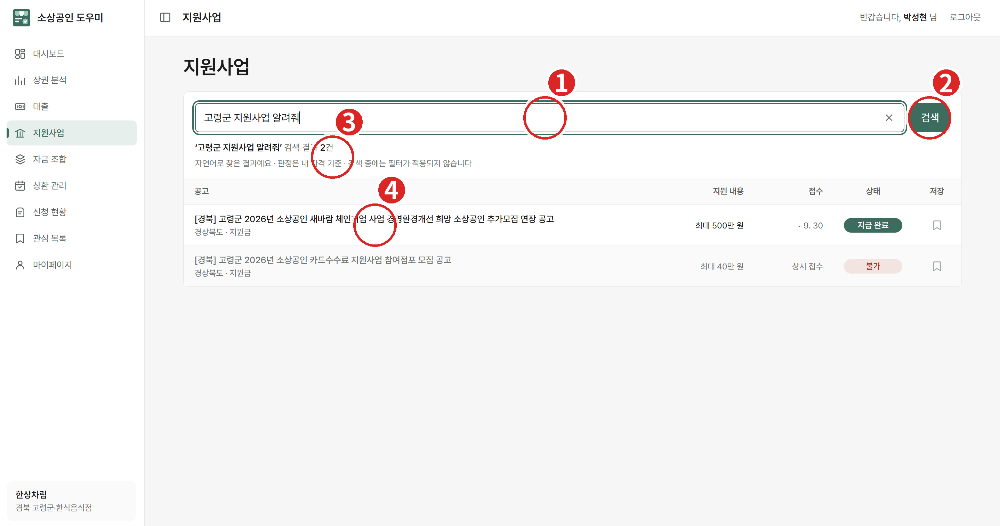

| 번호 | 위치 | 동작 |
|---|---|---|
| ① | 검색창에 입력 | `고령군 지원사업 알려줘` (또는 `키오스크 지원금`) |
| ② | **검색** | 클릭 |
| ③ | 안내 문구 | "자연어로 찾은 결과예요 · 판정은 내 자격 기준" |
| ④ | 결과 행 | 클릭해서 상세로 |

**말할 것**
> "공고 제목이 아니라 **본문 의미로** 찾습니다. '키오스크 지원금'처럼 제목에 없는 말로 검색해도 해당 공고가 나옵니다."
> "공고 본문을 350토큰씩 쪼개서 벡터로 만들어 두고, 질문도 같은 방식으로 바꿔서 가장 가까운 것을 찾습니다. **AI를 호출하지 않기 때문에 1초 안에** 돌아옵니다."

**확인 포인트** — 검색 결과에도 **내 자격 기준 판정 배지**가 그대로 붙습니다. 검색과 판정이 따로 노는 게 아니라는 점을 짚어 주세요.

---

## 2-7. 지원사업 상세

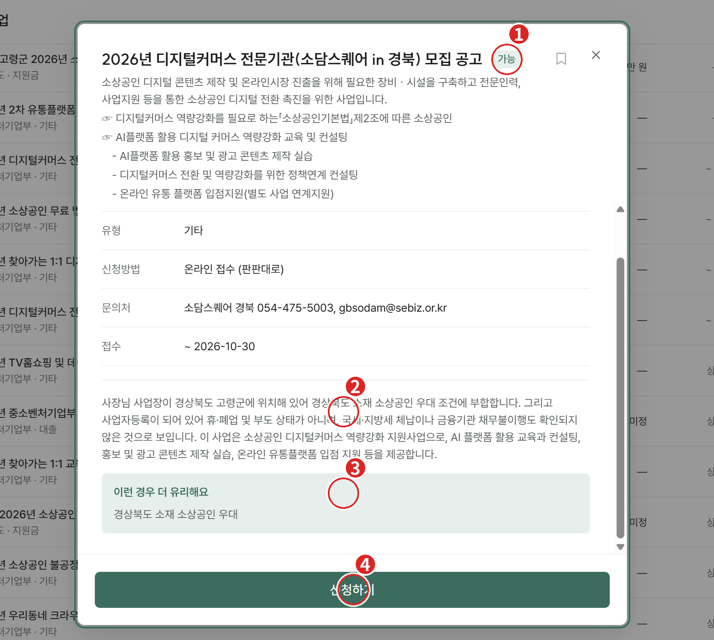

| 번호 | 위치 | 설명 |
|---|---|---|
| ① | 판정 배지 `가능` | 이 공고에 대한 내 판정 |
| ② | 판정 사유 문단 | **왜** 가능한지 AI가 근거를 문장으로 설명 |
| ③ | `이런 경우 더 유리해요` | 가점·우대 조건 |
| ④ | **신청하기** | 클릭 → 서류 단계로 |

**말할 것**
> "중요한 건 배지가 아니라 **이유**입니다. '경상북도 고령군에 사업장이 있어 지역 우대 조건에 부합하고, 휴·폐업이나 체납이 확인되지 않는다' — 이렇게 판단 근거를 문장으로 보여줍니다."
> "사장님이 직접 공고문 10장을 읽지 않아도 되는 이유입니다."

---

## 2-8. 서류 업로드

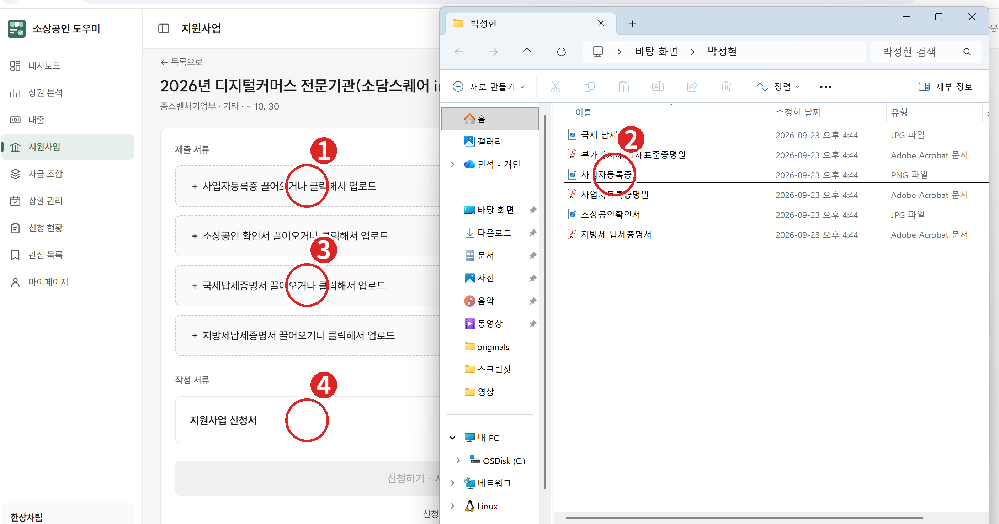

| 번호 | 위치 | 동작 |
|---|---|---|
| ① | 제출 서류 첫 칸(사업자등록증) | 클릭하거나 파일을 끌어다 놓기 |
| ② | 탐색기에서 파일 선택 | 미리 꺼내 둔 `사업자등록증.png` |
| ③ | 나머지 제출 서류 칸 | 소상공인 확인서 · 국세/지방세 납세증명서 |
| ④ | 작성 서류 `지원사업 신청서` | 다음 장면에서 AI 초안을 받을 항목 |

**말할 것**
> "공고마다 필요한 서류가 다릅니다. 이 공고는 제출 서류 4종과 작성 서류 1종입니다."
> "**제출 서류는 발급받아 올리는 것**, **작성 서류는 사장님이 직접 써야 하는 것**입니다. 소비는 앞쪽은 검증해 주고, 뒤쪽은 대신 작성해 줍니다."

---

## 2-9. 서류 AI 검증

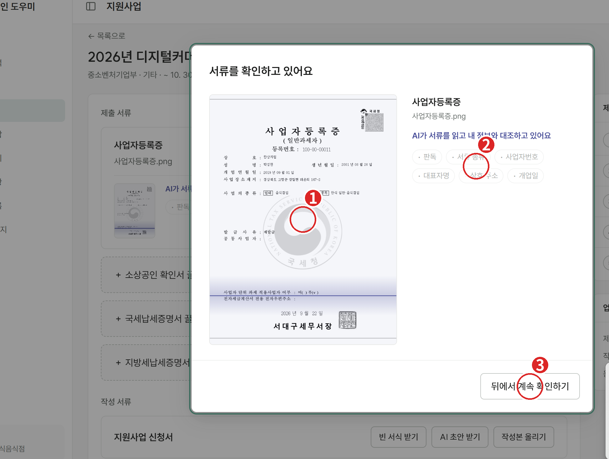

| 번호 | 위치 | 설명 |
|---|---|---|
| ① | 업로드된 서류 미리보기 | 올린 파일을 그대로 보여줌 |
| ② | 검증 항목 칩 | `판독 · 서류 종류 · 사업자번호 · 대표자명 · 상호·주소 · 개업일` 순서로 하나씩 통과 |
| ③ | **뒤에서 계속 확인하기** | 검증은 백그라운드로 돌리고 다른 작업 계속 |

**말할 것**
> "업로드하면 OCR이 서류를 읽고, 사장님 정보와 **하나씩 대조**합니다. 이 서류가 본인 것인지, 서류 종류가 맞는지, 도장과 발급일자가 있는지, 유효기간이 지나지 않았는지를 봅니다."
> "기관에서 반려될 사유를 **제출 전에** 잡는 겁니다."

### 일부러 틀린 서류 올려 보기 (꼭 보여주세요)

> "다른 사람 명의 서류를 올려 보겠습니다."

다른 사람 이름의 서류를 ①에 올리면 대조 단계에서 **실패로 표시되고 제출이 막힙니다.**
> "본인·타인·서류 종류가 섞인 16가지 상황을 테스트했고, 전부 걸러냈습니다."

**주의** — 검증에는 몇 초가 걸립니다. ③ 버튼을 눌러 두고 다음 서류를 올리면 시연이 매끄럽습니다.

---

## 2-10. AI 초안 작성

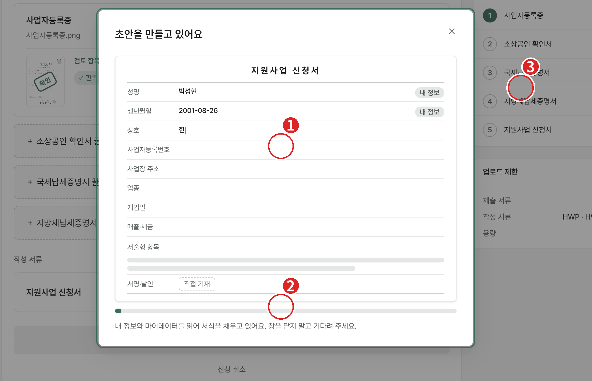

| 번호 | 위치 | 설명 |
|---|---|---|
| ① | 초안 미리보기 | 성명·생년월일·상호·사업자번호·주소·업종·개업일·매출이 **자동으로 채워짐** |
| ② | 진행 바 | 내 정보와 마이데이터를 읽어 서식을 채우는 중 |
| ③ | 우측 단계 목록 | 서류 5종의 진행 상태 |

**말할 것**
> "신청서는 대부분 HWP 서식입니다. 소비가 그 서식을 분석해서 **채워야 할 칸을 찾아내고**, 회원 정보·사업자 정보·마이데이터에서 값을 끌어와 초안을 만듭니다."
> "사장님은 서술형 항목만 확인하고 도장을 찍으면 됩니다."

**참고** — 버튼은 세 개입니다. `빈 서식 받기`(그냥 서식만) · `AI 초안 받기`(자동 작성) · `작성본 올리기`(직접 쓴 파일 업로드). 시연에서는 **AI 초안 받기**를 사용합니다.

---

## 2-11. 최종 제출과 신청 현황

> 📌 이 화면(신청 현황)은 전달받은 스크린샷에 없어 이미지가 비어 있습니다. 캡처를 주시면 같은 형식으로 추가해 드릴게요.

서류가 모두 통과하면 하단 **신청하기** 버튼이 활성화됩니다. 제출하면 **신청 현황** 페이지로 이동합니다.

**말할 것**
> "신청 현황에서는 준비 중 · 진행 중 · 완료를 한 목록에서 봅니다. 준비 중인 건은 **이어서 작성**으로 중단한 지점부터 다시 시작할 수 있습니다."

---

## 2-12. 대출 신청 — 상품 선택

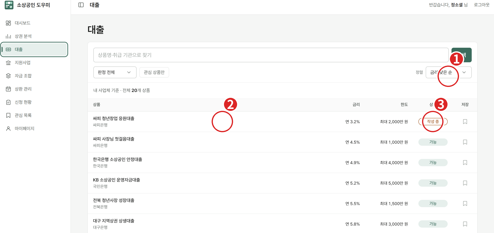

| 번호 | 위치 | 동작 |
|---|---|---|
| ① | 정렬 `금리 낮은 순` | 기본 정렬 |
| ② | 상품 행 | 클릭해서 신청 화면으로 |
| ③ | 상태 배지 `작성 중` | 서류를 이미 올려 둔 진행 중 건 |

**말할 것**
> "대출도 같은 방식입니다. 내 사업체 기준으로 판정된 20개 상품이 금리 순으로 정렬됩니다. 신용등급·업력·근로자 수·매출을 상품 요건과 정량 비교하기 때문에 여기는 가능·불가 두 가지로 확정됩니다."

**시연 팁** — 서류를 미리 올려 둔 **`작성 중` 상태의 건(③)** 으로 들어가세요. 업로드 과정을 반복하지 않아도 되고, "이어서 작성" 기능도 자연스럽게 보여집니다.

---

## 2-13. 대출 신청 — 금액과 계좌

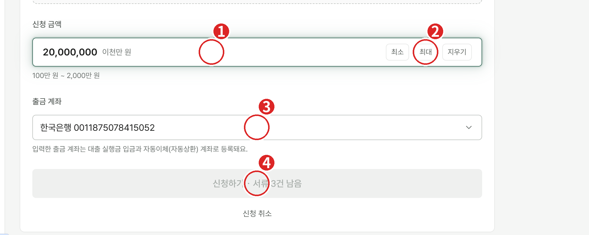

| 번호 | 위치 | 동작 |
|---|---|---|
| ① | 신청 금액 | `20,000,000` 입력 — 한글로 `이천만 원` 이 함께 표시됨 |
| ② | `최소 / 최대 / 지우기` | 한도 안에서 빠르게 채우기 |
| ③ | 출금 계좌 | 마이데이터로 들어온 계좌 중 선택 |
| ④ | **신청하기** | 서류가 다 통과해야 활성화 (`서류 3건 남음` 문구가 사라짐) |

**말할 것**
> "금액을 넣으면 한글로 같이 보여 줍니다. 0을 하나 더 쓰는 실수를 막기 위해서입니다."
> "여기서 고른 출금 계좌가 **실행금이 들어오는 계좌이자 자동이체 계좌**로 함께 등록됩니다. 따로 신청할 필요가 없습니다."
> "서류가 남아 있으면 버튼이 잠깁니다. 미비 서류로 반려되는 일을 구조적으로 막았습니다."

---

## 2-14. 상환 관리

> 📌 상환 관리 화면 캡처도 전달받은 이미지에 없습니다. 캡처를 주시면 추가하겠습니다.

**말할 것**
> "대출이 실행되면 상환 관리로 넘어옵니다. 잔액, 다음 상환일과 금액, 남은 회차, 자동이체 기록을 봅니다."
> "자동 상환은 **다음 날 아침 8시 30분부터** 등록된 출금 계좌에서 진행됩니다."
> "여유가 생겨 한 번에 갚으면 **아끼는 이자가 얼마인지** 계산해서 보여 주고, 완납도 이 화면에서 바로 됩니다."

완납까지 보여주면 **신청 → 실행 → 상환 → 완납**의 한 바퀴가 끝납니다.

---

# 3. 마무리 멘트

> "정리하면 소비는 네 단계입니다.
> **쉬운 신청** — 인증과 연동 한 번으로 211개 공고와 20개 대출이 판정됩니다.
> **시간 확보** — 공고를 찾고 서류를 챙기던 시간을 본업에 씁니다.
> **최적화된 상품** — 지원금을 먼저 채우고 부족한 만큼만 대출로 조합해 이자를 줄입니다.
> **그래서 가게가 오래 갑니다.**
> 지금은 기업마당 공고 222건 기준이지만, 같은 파이프라인으로 전국 지자체와 금융기관까지 넓힐 수 있습니다. 감사합니다."

---

# 4. 돌발 상황 대응

| 상황 | 대응 |
|---|---|
| 마이데이터 연동이 오래 걸림 | 판정 로직(정형 필터 + AI 검증)을 설명하며 기다리기. **버튼을 다시 누르지 않기** |
| 연동이 실패함 | 이미 연동된 **탭 2 계정**으로 넘어가서 계속 진행 |
| 서류 검증이 멈춘 것처럼 보임 | `뒤에서 계속 확인하기`를 누르고 다른 서류를 올리며 진행 |
| AI 초안이 느림 | "서식을 분석해 칸을 찾고 값을 채우는 중"이라고 설명. 미리 만들어 둔 초안 결과 화면으로 대체 |
| 특정 화면이 안 뜸 | 새로고침 한 번 → 안 되면 그 기능은 건너뛰고 다음 순서로. **시연 중 서버를 만지지 않기** |
| 심사위원 질문: "판정이 틀리면?" | "확정할 수 없는 조건은 불가가 아니라 **확인 필요**로 남깁니다. 최종 판단은 사장님이 합니다" |
| 심사위원 질문: "실제 기관과 연동되나?" | "지금은 SSAFY 금융망과 기업마당 공고 데이터 기준입니다. 기관 연계는 확장 구상입니다" |

---

# 5. 추가로 필요한 캡처

아래 두 화면은 이미지가 없어 설명만 넣어 뒀습니다. 캡처를 주시면 같은 형식(빨간 원 + 번호 + 설명)으로 채워 드립니다.

- 신청 현황 (전체 / 준비 중 / 진행 중 / 완료 탭이 보이는 화면)
- 상환 관리 (잔액 · 다음 상환일 · 자동이체 기록 · 완납 버튼이 보이는 화면)
